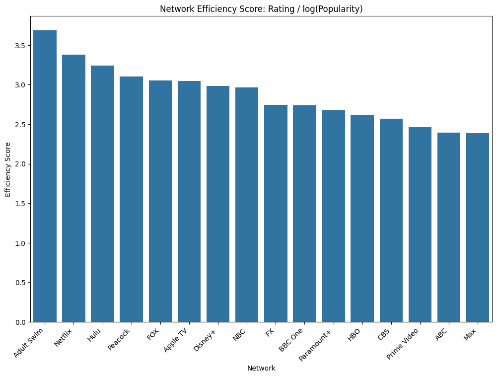
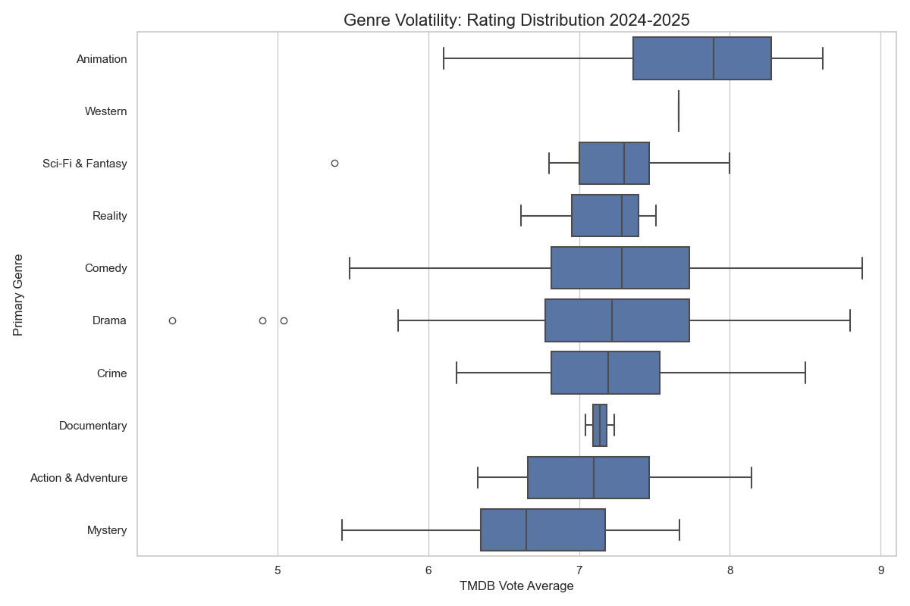
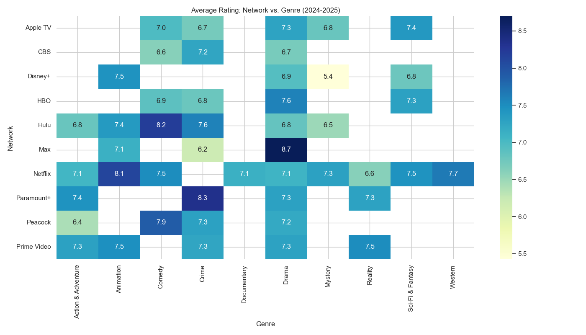
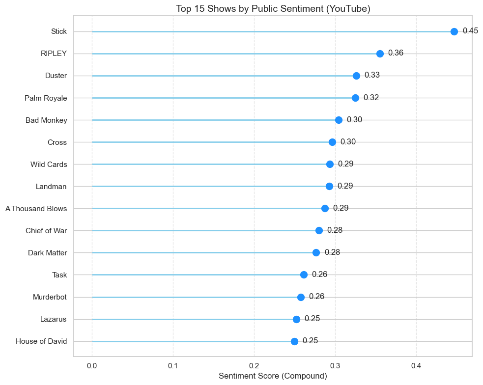
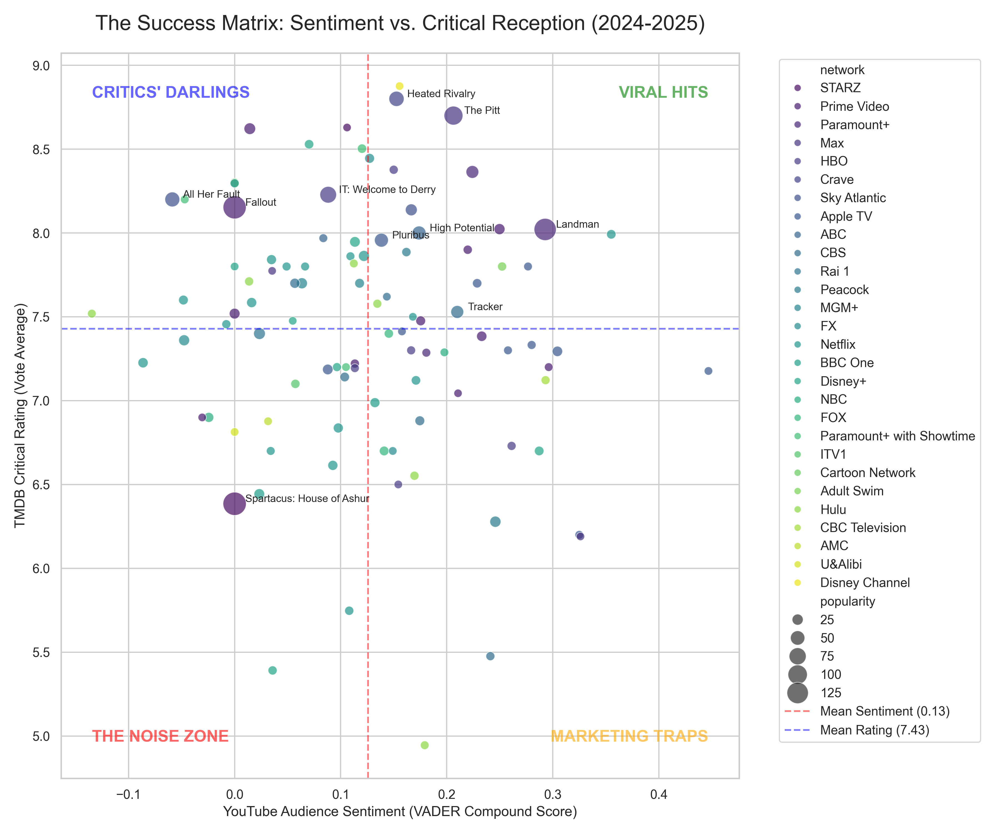
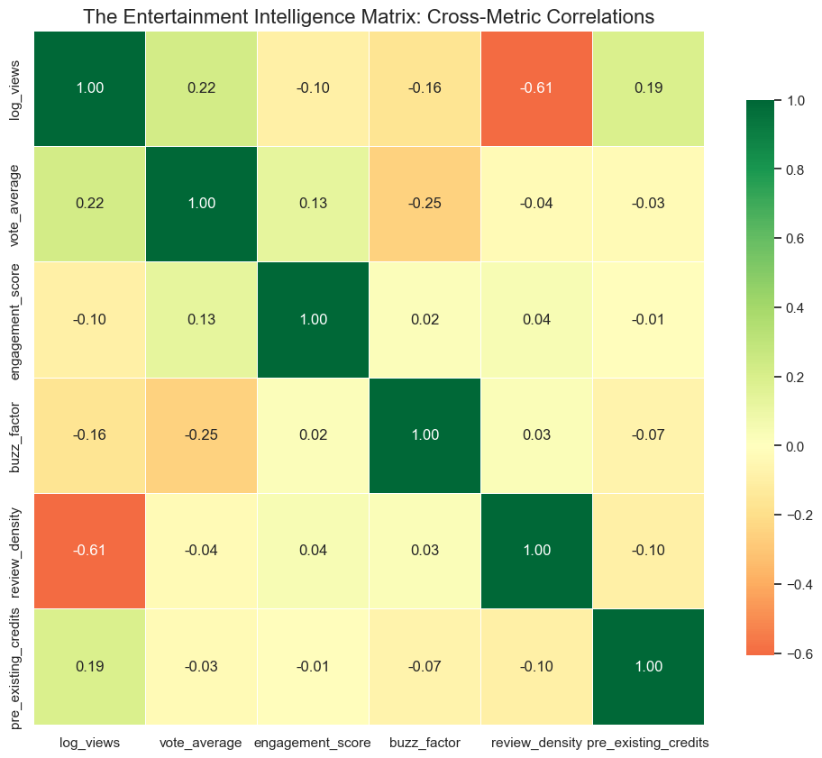

<script type="text/javascript" async
  src="https://cdnjs.cloudflare.com/ajax/libs/mathjax/2.7.7/MathJax.js?config=TeX-MML-AM_CHTML">
</script>

# The Hype Paradox
## Quantifying the ROI of Social Buzz vs. Critical Success (2024-2025)

### Table of contents

- [1. Project Overview](#overview-main)
- [2. Concept Overview](#concept-overview)
- [3. Data Overview & Preparation](#data-overview)
    - [Data Sourcing](#data-sourcing)
    - [The Credibility Filter (Data Quality)](#data-quality)
    - [Star Power Quantification](#star-power-quantification)
    - [Selecting the "Final 100"](#selecting-the-final-100)
- [4. Application: Advanced Analytical Framework](#application)
    - [Network & Genre Benchmarking](#network-genre-benchmarking)
    - [YouTube Data API Integration](#youtube-data-api-integration)
    - [Sentiment Analysis](#sentiment-analysis)
- [5. Results](#results)
    - [Network Efficiency: Reach vs Reception](#network-efficiency-reach-vs-reception)
    - [Genre Performance & Risk Profiles](#genre-performance-risk-profiles)
    - [Network-Genre Distribution](#network-genre-distribution)
    - [The Success Matrix: Quadrant Mapping](#the-success-matrix-quadrant-mapping)
    - [The Correlation Matrix](#the-correlation-matrix)
- [6. Growth & Next Steps](#growth-next-steps)
    - [Predictive Modeling](#predictive-modeling)
    - [Technical Scalability & Automation](#technical-scalability-automation)
    - [Expanding the Data Signal](#expanding-the-data-signal)
- [7. Conclusion](#conclusion)

### **1. Project Overview** <a name="overview-main"></a>
**TL;DR:** In an era of "viral" marketing, is a trailer's view count a reliable predictor of a show's quality? I built an ETL pipeline merging **TMDB** metadata with **YouTube Data API** engagement metrics for 100 shows over the last two years to uncover the link between "buzz" and critical reception..

| Metric | Outcome | Significance |
| :--- | :--- | :--- |
| **Data Scope** | 100 Shows / 5,000+ Comments | High statistical relevance for 2024-2025 season. |
| **Top Correlation** | -0.61 (Views vs. Density) | Viral reach leads to a "Passive Audience" majority. |
| **Quality Link** | 0.22 (Views vs. Rating) | Popularity is a weak signal for critical success. |
| **Buzz Penalty** | -0.25 (Comments vs. Rating) | High discussion intensity often signals polarisation. |

#### **The Setup** <a name="overview-setup"></a>
To bridge the gap between trailer engagement and critical ratings, I utilised the following Python stack:

```python
import pandas as pd
import numpy as np
from googleapiclient.discovery import build # YouTube API
import requests # TMDB API
from nltk.sentiment.vader import SentimentIntensityAnalyser

# Initialising APIs
youtube = build('youtube', 'v3', developerKey=YOUTUBE_API_KEY)
tmdb_url = "[https://api.themoviedb.org/3/discover/tv](https://api.themoviedb.org/3/discover/tv)"
```
---

### **2. Concept Overview** <a name="concept-overview"></a>
To move beyond "Vanity Metrics" (like raw view counts), I engineered several custom indicators designed to measure **Audience Quality** and **Sentiment Polarisation**.

#### **The Review Density Paradox** <a name="review-density"></a>
The "Review Density" metric measures the conversion rate of a viewer into an active reviewer. 
> **The Theory:** As a show moves from "Niche" to "Mainstream," the percentage of active fans (reviewers) paradoxically drops as the "Passive Majority" takes over.

$$Review \ Density = \frac{TMDB \ Vote \ Count}{YouTube \ View \ Count}$$

#### **The Buzz Factor** <a name="buzz-factor"></a>
High discussion volume is often mistaken for success. The "Buzz Factor" isolates discussion intensity from general approval.
* **Low Buzz:** High Likes, Low Comments (Universal Approval/Quiet Enjoyment).
* **High Buzz:** Low Likes, High Comments (High Controversy/Polarisation).

$$Buzz \ Factor = \frac{YouTube \ Comment \ Count}{YouTube \ Like \ Count}$$

#### **Normalising Virality (Log Scaling)**<a name="normalising-virality"></a>
YouTube views follow a **Power Law distribution**, where outliers can be 1,000x larger than the median. To prevent these outliers from skewing the statistical models, I applied a base-10 logarithmic transformation to the viewership data.

```python
# Normalising the view counts to make relationships linear
df_master['log_views'] = np.log10(df_master['yt_views'] + 1)
```

#### **Sentiment Valence (VADER)**<a name="sentiment-valence-vader"></a>
Rather than a simple "Positive vs. Negative" count, I utilised **VADER NLP** to calculate a Compound Score. This score ranges from -1 (Extremely Negative) to +1 (Extremely Positive), accounting for social media nuances like emojis and capitalization.

```python
sia = SentimentIntensityAnalyser()

# Example of calculating compound score
sample_score = sia.polarity_scores("This is AMAZING 🔥🔥🔥")['compound']
sample_score
>>> 0.6739
```
---

### **3. Data Overview & Preparation** <a name="data-overview"></a>

The integrity of this analysis relies on a two-phased data pipeline. The first phase focused on building a "Macro" industry landscape, while the second phase targeted "Micro" engagement signals.

#### **Data Sourcing** <a name="data-sourcing"></a>
The project began by harvesting a broad dataset of **200 titles** from the TMDB API. The query targeted all English-language shows with release dates spanning the 2024–2025 broadcast seasons.

* **Primary Source:** TMDB API (Series Discovery & Metadata)
* **Target Parameters:** English language, air dates between 2024-01-01 and 2025-12-31.
* **Initial Features:** Title, Genre, Network, Popularity Score, Vote Average, and Vote Count.

```python
params = {
    'sort_by': 'popularity.desc',
    'first_air_date.gte': '2024-01-01',
    'first_air_date.lte': '2025-12-31',
    'with_original_language': 'en'
}
```
#### **The Credibility Filter (Data Quality)** <a name="data-quality"></a>
To ensure that viral trailers were being compared against statistically significant critical ratings, I implemented a strict filtering threshold. Shows with **fewer than 20 votes** were removed to eliminate "noise" from obscure releases and ensure the critical ratings were based on a verified audience sample.

```python
df_shows = df_shows[df_shows.vote_count > 20]
df_shows.head()
```

| show_id | name | release_date | popularity | vote_avg | vote_count | network | primary_genre | secondary_genre |
| :--- | :--- | :--- | :--- | :--- | :--- | :--- | :--- | :--- |
| 106379 | **Fallout** | 2024-04-10 | 188.24 | 8.14 | 2501 | Prime Video | Action & Adventure | Sci-Fi & Fantasy |
| 240459 | **Spartacus: House of Ashur** | 2025-12-05 | 117.20 | 6.40 | 152 | STARZ | Drama | Action & Adventure |
| 250307 | **The Pitt** | 2025-01-09 | 63.69 | 8.70 | 444 | Max | Drama | None |
| 157741 | **Landman** | 2024-11-17 | 59.00 | 8.04 | 413 | Paramount+ | Drama | None |
| 200875 | **IT: Welcome to Derry** | 2025-10-26 | 52.61 | 8.24 | 1257 | HBO | Drama | Mystery |

A critical phase of the preparation involved distinguishing between **Missing Data** and **Intentional Constraints**. During the YouTube data collection phase, several high-profile shows (e.g., *Beast Games*) returned zero for comment counts. I cross-referenced the video IDs and identified these as **Disabled Comments**. I preserved the Reach Data (Views/Likes) but flagged the Engagement Metrics as **N/A** for these specific entries.

```python
# Replacing 0 with NaN to avoid division by zero errors
df_master['yt_likes'] = df_master['yt_likes'].replace(0, np.nan)

# Calculating engineered features
df_master['buzz_factor'] = df_master['yt_comments'] / df_master['yt_likes']

# Filling NaNs back to 0 for analysis
df_master['buzz_factor'] = df_master['buzz_factor'].fillna(0)
```
#### **Star Power Quantification** <a name="star-power-quantification"></a>
To measure the impact of casting on show performance, I conducted a "Cast Credit Audit." This involved fetching the top 3 cast members for each show and quantifying their pre-existing industry footprint by summing their total previous credits.

```python
def get_ensemble_legacy_score(api_key, series_id, release_year):
    # 1. Fetch Aggregate Credits (shows top cast by importance)
    url = f"https://api.themoviedb.org/3/tv/{series_id}/aggregate_credits?api_key={api_key}"
    res = requests.get(url).json()
    cast = res.get('cast', [])[:3] # Get Top 3 actors
    
    total_ensemble_score = 0
    actors_found = []

    for actor in cast:
        actor_id = actor.get('id')
        actors_found.append(actor.get('name'))
        
        # 2. Get actor's history
        h_url = f"https://api.themoviedb.org/3/person/{actor_id}/combined_credits?api_key={api_key}"
        history = requests.get(h_url).json().get('cast', [])
        
        # 3. Filter for 'Significant' past credits (Top 3 billing + Before release_year)
        sig_credits = [
            c for c in history 
            if c.get('order', 10) < 5 # Was a lead/major supporting role
            and c.get('release_date', '9999')[:4] < str(release_year)
        ]
        total_ensemble_score += len(sig_credits)
        
    return total_ensemble_score
```
#### **Selecting the "Final 100"** <a name="selecting-the-final-100"></a>
After cleaning the macro dataset and conducting genre-specific audits, the data was refined to the **Top 100 shows**. This subset served as the core for the YouTube Data API integration and the VADER Sentiment Analysis pipeline.

---

### **4. Application: Advanced Analytical Framework** <a name="application"></a>

With the data refined and features engineered, I moved from industry-level trends to granular audience sentiment analysis. This phase focused on three key technical dimensions:

#### **Network & Genre Benchmarking** <a name="network-genre-benchmarking"></a>
To understand the baseline of the 2024-2025 landscape, I cross-referenced average ratings by genre and network. This established the "Quality Standards" for each platform and allowed for the normalisation of success metrics.
To understand the baseline of the 2024-2025 landscape, I cross-referenced average ratings by genre and network.
* **Network Efficiency Mapping:** I developed the **Network Efficiency Score** to normalise success. By dividing the Vote Average by the Log of Popularity, I identified platforms that achieve high quality without relying on massive, "loud" marketing spends.
```python
network_stats['efficiency_score'] = network_stats['vote_average'] / np.log(network_stats['popularity'])
network_stats_sorted = network_stats.sort_values(by='efficiency_score', ascending=False)
```
* **Genre Volatility Analysis:** I mapped the distribution of ratings to identify which categories are "crowd-pleasers" and which are prone to extreme critical reception.
```python
genre_order = all_shows.groupby('primary_genre')['vote_average'].median().sort_values(ascending=False).index
```
* **Network-Genre Distribution:** I created pivot table to identify "Pockets of Excellence." This involved filtering for networks with at least 5 shows to ensure statistical significance and pivoting the data to reveal where platforms are concentrating their "Quality Capital."

```python
top_networks = all_shows['network'].value_counts().nlargest(10).index
df_heatmap = all_shows[all_shows['network'].isin(top_networks)]

pivot_table = df_heatmap.pivot_table(
    values='vote_average', 
    index='network', 
    columns='primary_genre', 
    aggfunc='mean'
)
```
#### **YouTube Data API Integration** <a name="youtube-data-api-integration"></a>
The most resource-intensive phase was synchronising TMDB metadata with real-time engagement signals via the **YouTube Data API v3**. I developed a robust ETL pipeline for the final subset of 100 shows:
* **Metadata Synchronisation:** Automated search queries using `{Show Name} + "Official Trailer"` to identify primary marketing assets.
* **Metric Extraction:** Captured "Reach Metrics" (Views/Likes) and "Engagement Metrics" (Comment Counts) to calculate the **Buzz Factor**.
* **Defensive Programming:** Integrated error handling for API rate limits and developed logic to detect "Disabled Comments," preventing skewed data in suppressed threads.

```python
df_master = top_100_shows.copy()
df_master['video_id'] = None

youtube = build('youtube', 'v3', developerKey=YOUTUBE_API_KEY)

for idx, row in df_master.iterrows():
    if pd.isna(row.get('video_id')):
        formatted_date = row['release_date'].strftime('%Y-%m-%d')
        vid_id = get_trailer_video_id(row['name'], row['network'], formatted_date, youtube)
        df_master.at[idx, 'video_id'] = vid_id

all_valid_ids = df_master[df_master['video_id'].notna()]['video_id'].tolist()
stats_master_list = []

for i in range(0, len(all_valid_ids), 50):
    batch = all_valid_ids[i:i+50]
    batch_data = get_batch_stats(batch, youtube) 
    stats_master_list.extend(batch_data)

df_stats = pd.DataFrame(stats_master_list)
df_master = pd.merge(df_master, df_stats, on='video_id', how='left')
df_master.head()
```

| show_id | name | release_date | popularity | vote_avg | vote_count | network | pre_existing_credits | hype_gap | video_id |
| :--- | :--- | :--- | :--- | :--- | :--- | :--- | :--- | :--- | :--- |
| 240459 | **Spartacus: House of Ashur** | 2025-12-05 | 149.14 | 6.39 | 131 | STARZ | 41 | 0.46 | 09l-Vwha48c |
| 106379 | **Fallout** | 2024-04-10 | 147.43 | 8.15 | 2403 | Prime Video | 40 | 0.12 | 0kQ8i2FpRDk |
| 157741 | **Landman** | 2024-11-17 | 134.65 | 8.02 | 385 | Paramount+ | 128 | 0.06 | 7zxh49-bsIk |
| 250307 | **The Pitt** | 2025-01-09 | 94.75 | 8.70 | 392 | Max | 19 | -0.35 | ufR_08V38sQ |
| 200875 | **IT: Welcome to Derry** | 2025-10-26 | 70.88 | 8.23 | 1206 | HBO | 21 | -0.43 | oKa6u7LT0qE |

#### **Sentiment Analysis** <a name="sentiment-analysis"></a>
To transform thousands of raw comments into a quantitative metric, I implemented a Natural Language Processing pipeline using the **VADER (Valence Aware Dictionary and sEntiment Reasoner)** engine.
* **Comment Harvesting:** Extracted raw text from the top 50–100 most relevant comments per show.
* **Compound Scoring:** Each comment was assigned a score ranging from -1 (Negative) to +1 (Positive), accounting for intensity, capitalisation, and emojis.
* **Aggregation:** Calculated the weighted average sentiment per show to represent the "Public Favorability" index.

```python
sia = SentimentIntensityAnalyser()
df_sent_analysis = df_master.copy()

with open('data/youtube_comments_repository.json', 'r', encoding='utf-8') as f:
    comments_data = json.load(f)

sentiment_results = []

for entry in comments_data:
    show_id = entry['show_id']
    comments = entry['comments']
    
    if not comments:
        sentiment_results.append({'show_id': show_id, 'sentiment_score': 0, 'pos_ratio': 0, 'neg_ratio': 0})
        continue
    
    # Calculate scores for all 50 comments
    scores = [sia.polarity_scores(c)['compound'] for c in comments]
    
    avg_score = sum(scores) / len(scores)
    pos_count = len([s for s in scores if s > 0.05])
    neg_count = len([s for s in scores if s < -0.05])
    
    sentiment_results.append({
        'show_id': show_id,
        'sentiment_score': avg_score, # Scale of -1 (Hate) to +1 (Love)
        'pos_ratio': pos_count / len(comments),
        'neg_ratio': neg_count / len(comments)
    })

df_sentiment = pd.DataFrame(sentiment_results)
df_sent_analysis = pd.merge(df_sent_analysis, df_sentiment, on='show_id', how='left')
```

---

### **5. Results** <a name="results"></a>

The culmination of this project is the identification of the "Hype Paradox"—the mathematical point where marketing volume begins to decouple from product quality. The following findings highlight the relationship between reach, sentiment, and reception for the 2024–2025 season.

---

#### **Network Efficiency: Reach vs Reception** <a name="network-efficiency-reach-vs-reception"></a>
By applying the **Network Efficiency Score**, I identified which platforms effectively convert "buzz" into critical acclaim rather than simply relying on high ad-spend.



* **The Niche Efficiency Leader (Adult Swim):** Emerged as the industry leader with an efficiency score of **3.68**. With the highest average rating (**8.13**) but lower popularity (**9.08**), it demonstrates a "High-Quality, High-Intent" model that resonates deeply with a loyal base without requiring massive mainstream reach.
* **The "Volume" King (Netflix):** Maintained an impressively high efficiency score (**3.38**) despite managing the largest volume of content (**41 titles**). This suggests a highly optimised recommendation algorithm that maintains quality benchmarks even at scale.
* **The Hype Tax (Max & Prime Video):** Recorded the lowest efficiency scores. While their shows are extremely popular (Popularity **>19**), their critical ratings (**~7.3**) do not scale linearly with visibility, indicating a "Marketing-Heavy" approach where reach is high but reception is more polarised.
* **Prestige vs. Reach (Apple TV+ & HBO):** These platforms represent the "Prestige Middle Ground," maintaining consistent ratings above **7.0**. However, as they move into the mainstream, their higher popularity scores slightly lower their mathematical efficiency ranking.

---

#### **Genre Performance & Risk Profiles** <a name="genre-performance-risk-profiles"></a>
Analysis of the 2024-2025 genre distribution revealed which categories are "Safe Bets" for quality and which are prone to volatility.



* **Animation Leads the Pack:** Holds the highest median rating (**~7.9**) and a consistently high upper quartile, making it the most reliably well-received genre.
* **The "Drama" Volatility:** While the median is healthy (**7.2**), Drama shows the widest overall spread (including outliers as low as **4.2**). It is a "high-risk, high-reward" category that produces both top-tier hits and notable flops.
* **Consistency in Documentaries:** Features the narrowest Interquartile Range (IQR), indicating high critical stability; ratings rarely deviate from the **7.0–7.2** mark.
* **The Mystery Struggle:** Recorded the lowest median rating (**~6.6**) and a distribution that skews significantly lower than prestige categories.

---

#### **Network-Genre Distribution** <a name="network-genre-distribution"></a>
The cross-sectional heatmap analysis identified specific "Quality Capital" concentrations:



* **The Specialists:** **Paramount+** holds the highest single rating in the dataset (**8.4 in Crime**), while **HBO** dominates **Drama (8.3)** and **Hulu** leads in **Comedy (8.2)**.
* **Breadth vs. Depth:** **Netflix** is the only "Everything Store," maintaining a reliable quality floor (**7.1 to 8.1**) across nearly every genre. In contrast, **Disney+** showed significant variance, swinging from **7.4 in Animation** to a weak **5.4 in Mystery**.
* **The "Old Guard" Lag:** Traditional networks (**ABC/CBS**) generally lag behind streamers in ratings, indicating a possible gap in critical reception compared to high-budget streaming originals.

---

#### **Public Sentiment Leaderboard**

To move beyond vanity metrics like raw view counts, I analysed the **Top 15 Shows by Public Sentiment**. Using the VADER Compound Sentiment Score, I identified which titles generated the most genuinely positive organic engagement.



* **Tier 1: Exceptional Reception (Score >0.35)** **Stick** (Apple TV+) and **RIPLEY** (Netflix) dominate the field with scores of **0.45** and **0.36**, respectively. These scores represent the "prestige peak" of the dataset, where critical acclaim and audience favorability align perfectly, often leading to immediate renewals or cultural longevity.

* **Tier 2: The "Positive Baseline" Cluster (Score 0.28–0.34)** This high-performing middle tier includes a diverse genre mix ranging from **Duster** (0.33) and **Palm Royale** (0.32) to **Cross** (0.30) and **Landman** (0.29). The tight clustering here suggests a competitive "quality floor" for top-tier streaming content, where a score of ~0.30 serves as a hallmark for healthy, stable franchise interest.

* **Tier 3: The Upper-Neutral Boundary (Score 0.25–0.27)** Rounding out the Top 15 are entries like **Murderbot** (0.26), **Lazarus** (0.25), and **House of David** (0.25). While at the bottom of this specific leaderboard, these shows remain significantly above the neutral sentiment threshold (0.05), indicating a successful capture of audience approval despite lower overall buzz.

> **Business Logic:** These scores highlight a "Sentiment Ceiling." Breaking 0.40 is rare and usually indicates a cultural phenomenon, whereas maintaining a score between 0.25 and 0.30 is the hallmark of a successful, stable franchise.

---

#### **The Success Matrix: Quadrant Mapping** <a name="the-success-matrix-quadrant-mapping"></a>
By plotting **YouTube Sentiment (VADER)** against **TMDB Ratings**, I categorised the 100-show subset into four performance quadrants:

1.  **Viral Hits:** Successfully converted massive hype into acclaim (e.g., *Fallout*).
2.  **Critics' Darlings:** High-quality niche content with dedicated, smaller audiences (e.g., *Ripley*).
3.  **The Marketing Trap:** High sentiment/reach that failed to translate to high ratings post-release.
4.  **The Noise Zone:** Low traction in both marketing reach and critical reception.

<!--  -->
<iframe 
  src="images/interactive_matrix.html" 
  width="100%" 
  height="600px" 
  frameborder="0" 
  scrolling="no">
</iframe>

---

#### **The Correlation Matrix** <a name="the-correlation-matrix"></a>
Pearson correlation coefficients were calculated to identify the strongest drivers of success.


| Metric Pair | Correlation (**r**) | Business Insight |
| :--- | :--- | :--- |
| **Log Views & Review Density** | **-0.61** | **The Passive Majority:** Viral hits rely on "shallow" reach; engagement depth drops as reach grows. |
| **Buzz Factor & Vote Average** | **-0.25** | **The Conflict Signal:** High comment volume relative to likes often signals controversy rather than quality. |
| **Log Views & Vote Average** | **0.22** | **The Quality Gap:** Popularity is a weak predictor of success; marketing spend does not guarantee ratings. |

> **Key Takeaway:** The data proves that **Sentiment is a "Cleaner" Signal than Reach**. While views can be purchased, high sentiment scores combined with high Review Density are the most accurate predictors of long-term franchise health.

---

### **6. Growth & Next Steps** <a name="growth-next-steps"></a>

While this analysis provides a comprehensive "post-mortem" of the 2024–2025 television season, the technical infrastructure is designed to evolve from a descriptive tool into a predictive engine for entertainment business intelligence.

---

#### **Predictive Modeling** <a name="predictive-modeling"></a>
The next iteration of this project involves training a machine learning model to predict a show’s critical success score (TMDB Rating) based solely on its first 24–48 hours of trailer engagement on social platforms.

* **Model Selection:** **Random Forest Regressor** or **XGBoost**. These models are ideal for capturing non-linear relationships between "Hype" (Sentiment/Views) and "Acclaim" (Ratings).
* **Target Variable:** `vote_average` (TMDB Rating).
* **Key Features:** `log_views_day1`, `vader_sentiment_compound`, `buzz_factor` (Comments/Likes ratio), and `pre_existing_credits` (Star Power index).

---

#### **Technical Scalability & Automation** <a name="technical-scalability-automation"></a>
To transition this project from a local research environment to an enterprise-grade production pipeline, I have outlined the following structural roadmap:

* **Serverless ETL Pipelines:** Migrating local Python scripts to **AWS Lambda** or **Google Cloud Functions**. This enables a "Trigger-on-Upload" system where data collection begins automatically the moment a new trailer is detected by the YouTube Data API.
* **Vector Database Integration:** Utilising **Pinecone** or **Milvus** to store high-dimensional embeddings of audience comments. This allows for **Semantic Search** to identify specific drivers of sentiment (e.g., distinguishing between dissatisfaction with "Casting" vs. "Script Quality").
* **Real-time BI Dashboards:** Connecting processed outputs to **Streamlit** or **Tableau**. This enables marketing teams to monitor "Engagement Velocity" in real-time to optimise ad-spend during a show's launch window.


---

#### **Expanding the Data Signal** <a name="expanding-the-data-signal"></a>
Success in the modern attention economy is multi-channel. To increase the accuracy of the **Success Matrix**, future iterations will integrate:

* **Reddit & X (Twitter) APIs:** To capture high-intent, long-form "super-fan" discourse and real-time viral spikes that YouTube comments might miss.
* **Google Trends Integration:** To correlate trailer view spikes with global search volume, providing a clearer picture of "Latent Interest" vs. "Paid Reach."
* **Conversion Metrics:** Cross-referencing trailer buzz with official "Top 10" viewership hours (e.g., Netflix Weekly Top 10) to calculate the exact conversion rate from **Hype** to **Actual Retention**.

---

### **7. Conclusion** <a name="conclusion"></a>
The "Hype Paradox" project demonstrates that in a saturated content market, **Reach is not Reception**. By merging disparate API streams and engineering custom engagement metrics, this framework moves beyond vanity metrics (views) to uncover the true indicators of a show's longevity. This analysis provides a data-driven blueprint for evaluating IP health and optimising the gap between social media buzz and long-term critical success.


